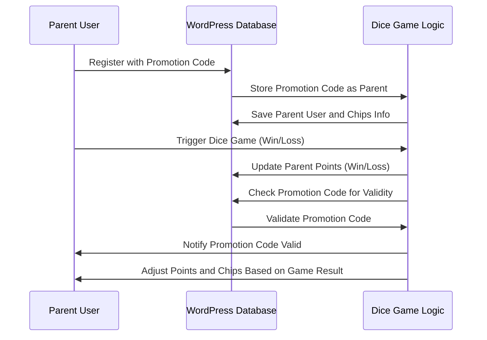
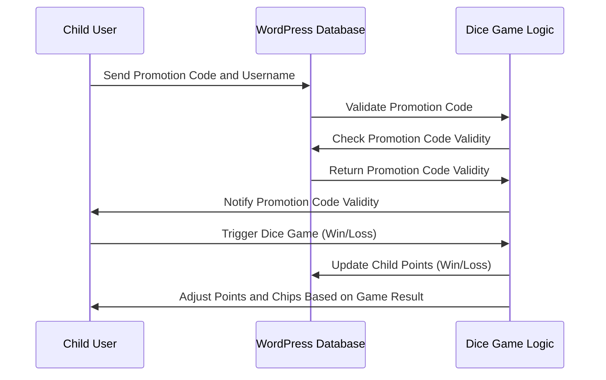
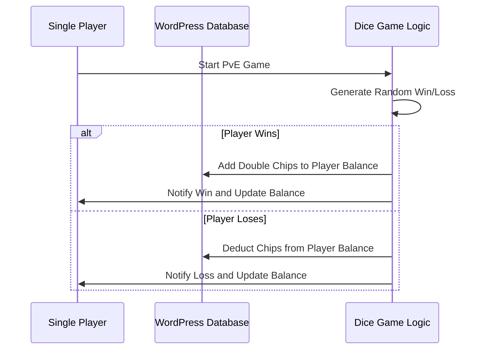
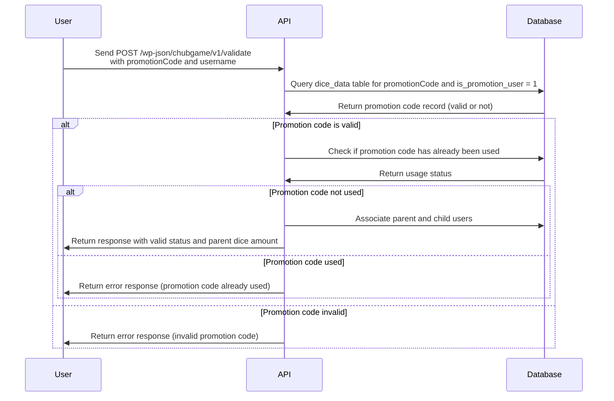
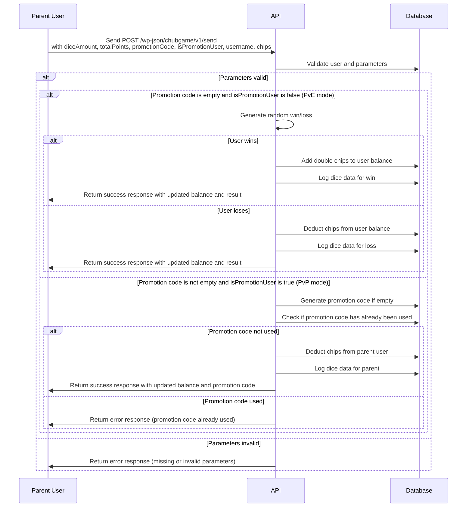
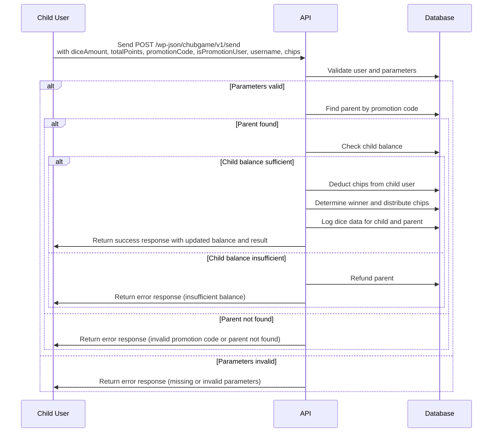
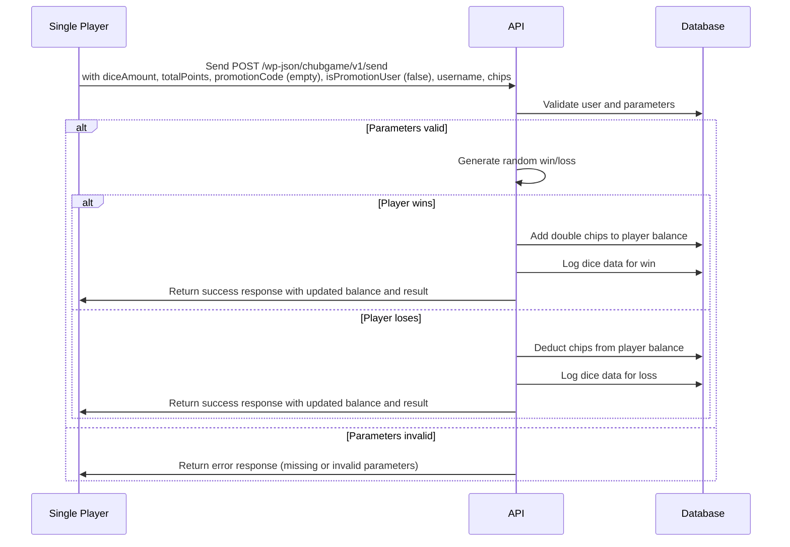

## ChubGame WP REST API

## Game Logic

### Parent User Sequence Diagram



Child User Sequence Diagram:



PvE Single Player Sequence Diagram



## WordPress API Endpoints

### Flowchart for the Validate Promotion Code

Promotion Code Verification for Child User:



### Flowchart for the Send Dice Data

Parent User Sequence Diagram:



Child User Sequence Diagram:



PvE Single Player Sequence Diagram:



## Promotion Code Validation API

Validates a promotion code and associates the parent user with the promotion code.

### Endpoint

`POST /wp-json/chubgame/v1/validate`

### Parameters

- `promotionCode` (string): The promotion code to validate.
- `username` (string): The username of the child user.

### Response

#### Success

```json
{
    "code": 200,
    "message": "Promotion code is valid and successfully applied.",
    "data": {
        "status": "success",
        "valid": true,
        "parent_user_id": 123,
        "parent_dice_amount": 5
    }
}
```

#### Error

```json
{
    "code": 400,
    "message": "Invalid promotion code",
    "data": {
        "status": "invalid_promotion_code"
    }
}
```

## Balance Validation API

Checks if the user has sufficient balance for the specified chips.

### Endpoint

`POST /wp-json/chubgame/v1/check-balance`

### Parameters

- `username` (string): The username of the user.
- `chips` (int): The number of chips to check.

### Response

#### Success

```json
{
    "code": 200,
    "message": "Balance is sufficient for current user",
    "data": {
        "status": "success",
        "balance": 1000
    }
}
```

#### Error

```json
{
    "code": 400,
    "message": "Insufficient balance for parent user",
    "data": {
        "status": "insufficient_balance",
        "balance": 500
    }
}
```

## Dice Data and Manage Chips API

Handles the dice game data and manages the chips for parent and child users.

### Endpoint

`POST /wp-json/chubgame/v1/send`

### Parameters

- `diceAmount` (int): The amount of dice rolled.
- `totalPoints` (int): The total points scored.
- `promotionCode` (string): Optional: The promotion code used, if empty, then the user is in the PvE mode.
- `isPromotionUser` (bool): Indicates if the user is a promotion user.
- `username` (string): The username of the user.
- `chips` (int): The number of chips of the current user.

### Response

#### Success

```json
{
    "code": 200,
    "message": "Game processed successfully",
    "data": {
        "status": "success",
        "balance": 1000,
        "result": 100,
        "promotion_code": "DEBUGCODE1234567"
    }
}
```

#### Error

```json
{
    "code": 400,
    "message": "This promotion code has already been used",
    "data": {
        "status": "promotion_used"
    }
}
```

## FAQ

1. Using Nginx as a reverse proxy for the WordPress REST API cause the error `404 Not Found`

    - **Solution**: Add the following configuration to the Nginx configuration file:

    ```nginx
        listen 80;
        server_name 127.0.0.1;
        index index.html index.htm index.php;
        root  /www/wwwroot/127_0_0_1;
        location / {
            try_files $uri $uri/ /index.php?$args;
        }
    ```
